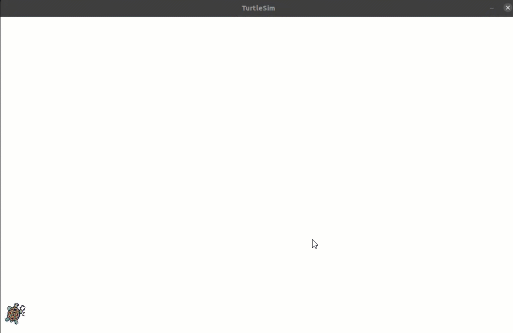
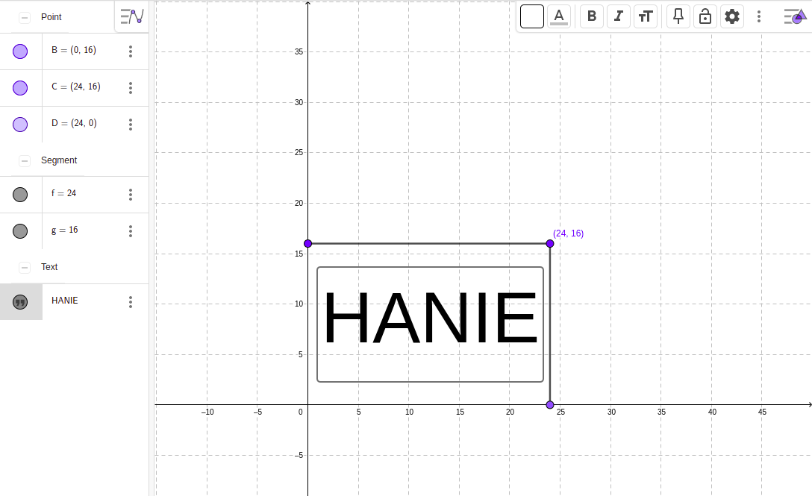
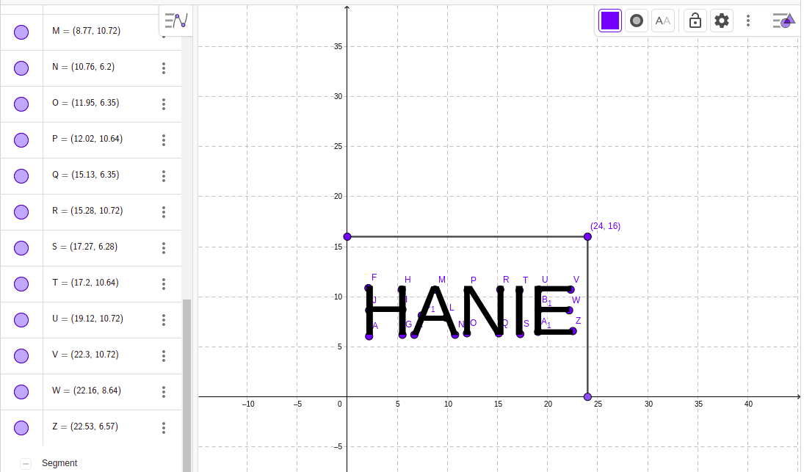
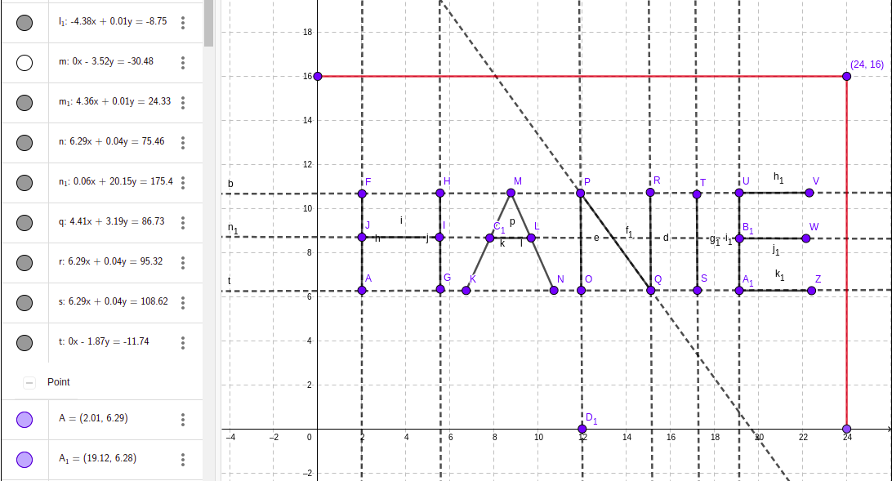
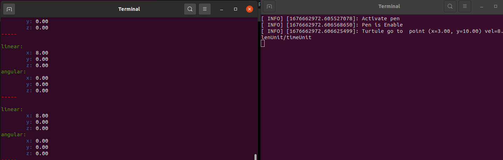
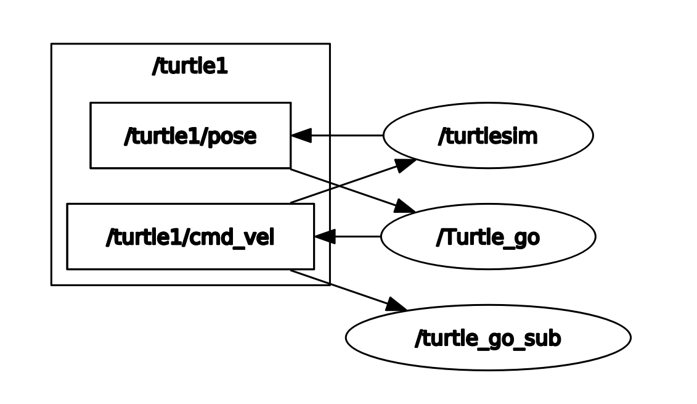

# Turtle_go
Turtlesim c++ package for drawing

This project has 3 Packages:
  - ***turtlesim***  I did not implement this Packages but i customized it
  - ***turtle_go***  position control used to send cmd_vel to turtlesim and recive pose of the robot i implement this with oop to avoid working with nasty global variable
  - ***turtle_sub_cmdvel**** just used to subscribe for cmd_vel and print it out

## Hardpoint coordinates
I used [GeoGebra](https://www.geogebra.org/) to determine hardpoints of letters like following

 

<!-- #### Then construct lines -->
<!--    -->
 

#### Record the slope from vector and length from segment for each line. 

## Terminal output

## RQT Graph

## Future work

 - Make anther node with python (Matplotlib) to plot data in runtime 
## Referance
 - https://github.com/ros/ros_tutorials/tree/821a8ae33c6da1a70e21453392f6980380f670f8/turtlesim
 - http://motion.cs.illinois.edu/RoboticSystems/CoordinateTransformations.html
# turtle-draw
